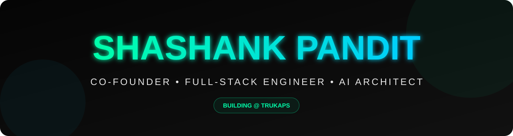

  

  

  <strong>Co-Founder @ TruKaps</strong> • Building high-impact AI SaaS & modern web platforms

---

### 🏆 Trophies & Contribution Graph

## 🐍 Contribution Snake

  

  

  

---

### 🛠️ Tech Stack

  
  
  
  
  
  
  
  

---

### 🔥 Featured Projects

<table align="center" style="width:100%; border-collapse: collapse; margin-top: 20px;">
  <tr>
    <td align="center" width="50%">
      
        
      <strong>Voting System</strong> 
      <a href="https://github.com/shashankpandit1/Blockchain-voting-app">→ View Repository</a>
    </td>
    <td align="center" width="50%">
      
        
      <strong>LuxeCart ECOM</strong> 
      <a href="https://github.com/shashankpandit1/LuxeCart-ECOM">→ View Repository</a>
    </td>
  </tr>
</table>

---

### 🌐 Connect & Resume

  
  
  
  

  

---

  <strong>Made with passion & code</strong> 💻✨  
   
  <em>Shashank Pandit — Co-Founder & Full-Stack Engineer</em>

